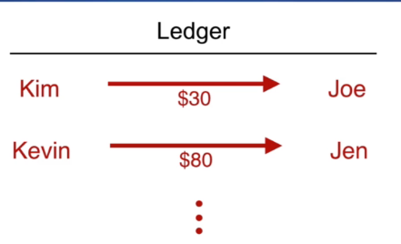

# Blockchain Udemy Course

## Course Steps
1. Blockchain data structure
2. Buid a API
3. Creating a decentralized network
4. Consensus algorithm
5. Block explorer (UI)

#  What is a Blockchain?

* A ledger (registry) which is 
  * Immutable
  * Distributed


**Ledger**: a collection of financial accounts or transactions that people have made



**Immutable**: once the transaction recorded, it can't be changed.

**Distributed**: the ledge is not controlled by a single entity.

There is not a single company controlling the blockchain. It's distributed among a lot of people, each one is called a **node**. Each one has the same copy of the ledge.

# JavaScript introduction


## Constructor function

```js
//Constructor function
function User(firstName, lastName, age, gender){
	// "this" refers to the object created by the constructor function
    this.firstName = firstName
	this.lastName = lastName
	this.age = age
	this.gender = gender
}

//Instance
var user1 = new User("John", "Smith", 26, "male")
```


## Prototype Object

A object that can be referenced from multiple objects so they can get the information or functionality that they want.

Data available to multiple instances of a object. 

```js
User.prototype.emailDomain = "@forumdomain.com"

user1.emailDomain // this works

User.prototype.getEmailAddress = function(){
    return this.firstName + this.lastName + this.emailDomain
}

user1.getEmailAddress() //this works
```

# Nonce

A **nonce** is a number that guarantees the legitimacy of a block.

A proof that a block was created by a legitimate way.

It can be tested via a proof of  work method.

# Proof of Work

A blockchain is a list of blocks, every block must be created and added to the chain

**BUT**

we don't want any block to be created and added to the chain, we need to be sure that every new block is legitimate and have the correct transactions (data), otherwise people can cause fraud.

A proof of work is a function that receives the current block data and tries to  find a specific hash.

Like: a hash that starts with four zeros.

**How**: by trial and error, changing the nonce value until the condition happens


A proof of work is supposed to be very difficult to calculate, but once you have the proof/nonce, it's very easy to verify that the nonce is correct, and this means that the block is a valid one.


## How the proof of work makes the blockchain secure?

**First:**

To find the correct hash, the nonce value will change many times. 

In order to generate the correct hash, it will use a lot of:

* Computing power
* Runs of `hashBlock`
* Energy
* A ton of calculations

Trying to recreate or re-mine a already existing block with fake data it not feasible.


 **Second**

The process of creating a hash depends on the old block's hash...

So: All blocks in the blockchain  are linked by their data.

So: If someone was trying to re-mine or recreate a block that already exists, they will also need to recreate all blocks before the changed block.

-----


# Decentralized Network

* All blockchain technology is hosted across a decentralized network
* Each node will run a instance of a API - Each instance will be a node
* All nodes will work together to host the blockchain 


## Secure?

If there is one bad player at the network, trying to cheat the system, each node can refer to the other ones to find how the real data should be and how the blockchain should look like.

## Powerful?

Yon don't have to trust one single entity with all data.


